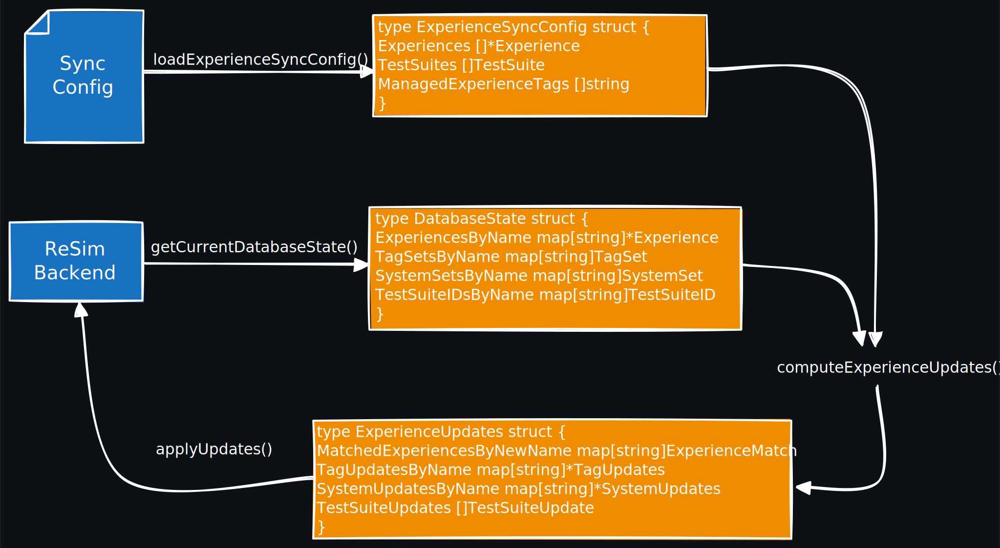

# Experience Syncing

## Summary

*Note: these are developer docs, meaning that they focus on how these libraries work and not on what
this feature does or how to use it. For user documentation, please refer to the [ReSim
docs](https://docs.resim.ai/).* <!-- TODO(mikebauer) Add a link to a specific user docs page here -->

The contents of this package are intended to facilitate the easy updating of experiences based on a
generated or static config file. This config file describes the experiences the user wants to have
in their resim app, the tags and systems they want them to have, and the test suites they want with
said experiences in them. Here's an example config to make things concrete:

```lang=yaml
experiences:
    - name: scenario-survey-alpha
      description: Aerial survey over test zone
      locations:
        - s3://drone-missions/surveys/alpha-test-zone
      profile: full_stack
	  tags:
	    - regression
      environment_variables:
        - name: MAX_ALTITUDE_M
          value: "120"
		  
    - name: new-scenario-system-check
      description: Regression validation run
      locations:
        - s3://drone-missions/system-checks/regression-1
      profile: planner_stack
	  tags:
	    - regression
		- progression
      systems:
        - mbauer_tmp_hil_repro
      environment_variables:
        - name: TEST_MODE
          value: "true"
	  
managed_test_suites:
    - name: Basic Suite
      experiences:
        - scenario-survey-alpha
        - new-scenario-system-check

managed_experience_tags:
    - regression
    - progression
```

The user can then run:

```lang=bash
resim experiences sync \
    --project <project-name> \
	--experience-config <config/file/path.yaml>
```

And the CLI will be responsible for ensuring that the specified experiences exist and have the
specified tags. Currently the tags in the `managed_experience_tags` list are removed from
experiences not explicitly listing them, and the resulting test suites contain *only* the
experiences that they list. Systems and unmanaged experience tags are never removed from
experiences.

## Approach


