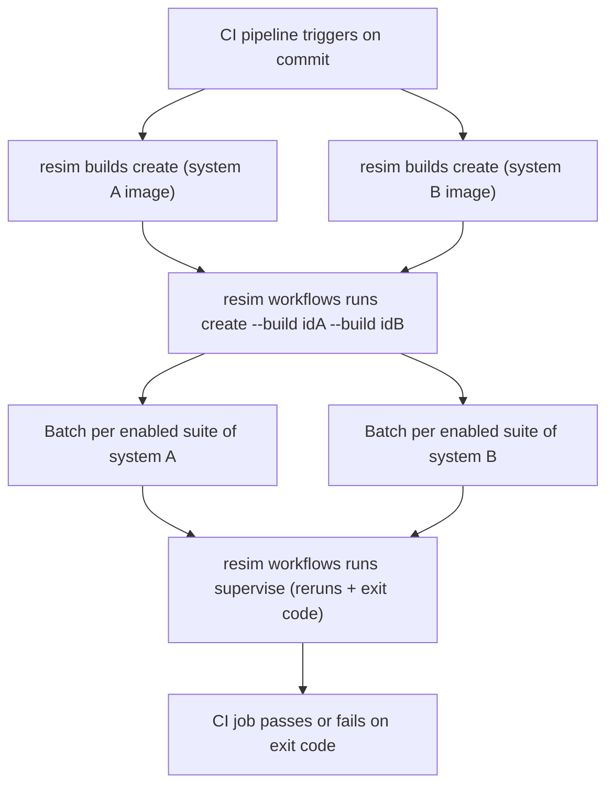

# Workflows in ReSim

A **workflow** is a named, reusable bundle of test suites that you run together against a set of builds — typically once per commit or per release candidate from CI. Where a single batch answers "how does this build perform on these experiences?", a workflow answers "how does this version of our software perform across all the test suites we care about?", producing one batch per enabled suite in a single operation.

## Concepts

| Concept | Description |
|---|---|
| Workflow | A project-scoped collection of test suites, each marked enabled or disabled. Has a name, description, and an optional CI link. |
| Workflow suite | A membership record tying a test suite to a workflow, with an `enabled` flag. Disabling a suite keeps it associated but skips it at run time. |
| System | The (sub)system under test, e.g. a planner, a perception stack, or full-vehicle software. Every test suite targets exactly one system, and every build belongs to exactly one system. |
| Build | A versioned, runnable image (or compose-based build spec) of one system, created with `resim builds create`. |
| Workflow run | One execution of a workflow: you supply one build per system covered by the workflow's enabled suites, and ReSim launches one batch per enabled suite, pairing each suite with the build for its system. |

Because each test suite targets a system, a workflow that contains suites for several different systems implicitly *requires* a build for each of those systems at run time. The API exposes this as the workflow's `requiredSystems`. Nothing prevents — and nothing special is needed to allow — a workflow from spanning multiple systems; the requirement only materializes when you run it.

## Creating and updating workflows

Workflows are created from a list of suites, supplied as inline JSON or a JSON file. Suites can be referenced by name or UUID:

```bash
resim workflows create \
  --project "my-project" \
  --name "nightly-regression" \
  --description "Full regression: planner + perception" \
  --suites '[
    {"testSuite": "planner-regression", "enabled": true},
    {"testSuite": "perception-smoke", "enabled": true},
    {"testSuite": "slow-soak-tests", "enabled": false}
  ]'
```

(`--suites-file path/to/suites.json` is equivalent. `--ci-link` optionally records a link to the CI pipeline that triggers this workflow.)

`resim workflows update` edits metadata (`--name`, `--description`, `--ci-link`) and/or reconciles the suite list: when you pass `--suites`/`--suites-file`, the CLI diffs the supplied list against the current state and adds, removes, and toggles suites so the workflow matches the full list you provided. It is declarative — omitting a suite removes it.

`resim workflows list` and `resim workflows get` show each workflow with its suites and their enabled states.

## Running workflows

```bash
resim workflows runs create --project <project> --workflow <name-or-id> [build flags...]
```

A run needs **one build per system** covered by the workflow's enabled suites. There are three ways to supply builds, exactly one of which must be used:

### 1. Repeatable `--build` (simple multi-build)

```bash
resim workflows runs create \
  --project my-project \
  --workflow nightly-regression \
  --build 11111111-1111-1111-1111-111111111111 \
  --build 22222222-2222-2222-2222-222222222222
```

Each `--build` is a build ID; the system each build covers is derived server-side from the build itself, so no system needs to be named on the command line. With this form, the run-level flags apply to *every* build in the run:

- `--parameter <name>=<value>` (repeatable): parameter overrides passed to each batch.
- `--pool-labels <label,...>`: where to run; labels are a logical AND.
- `--allowable-failure-percent <0-100>`: max percentage of tests that may hit an execution error while still computing aggregate metrics and counting the run as complete.

### 2. `--builds` / `--builds-file` JSON (per-build configuration)

When different systems need different parameters, pool labels, or failure tolerances, describe each build as a JSON object:

```bash
resim workflows runs create \
  --project my-project \
  --workflow nightly-regression \
  --builds '[
    {
      "buildID": "11111111-1111-1111-1111-111111111111",
      "parameters": {"speed": "fast"},
      "poolLabels": ["gpu", "large"],
      "allowableFailurePercent": 10
    },
    {"buildID": "22222222-2222-2222-2222-222222222222"}
  ]'
```

All entry fields except `buildID` are optional and apply only to that build's batches. Because configuration is per-entry here, the run-level `--parameter`, `--pool-labels`, and `--allowable-failure-percent` flags cannot be combined with `--builds`/`--builds-file`.

### 3. `--build-id` (deprecated)

The legacy single-build flag still works — it is converted internally to a one-entry builds list — but prints a deprecation warning and is hidden from `--help`. Use `--build` or `--builds` instead, even for single-system workflows.

### Validation rules

The CLI rejects, before calling the API:

- More than one build mechanism at once (e.g. `--build` together with `--builds`).
- Run-level override flags combined with `--builds`/`--builds-file`.
- Duplicate build IDs, malformed UUIDs, the reserved pool label `resim`, and `allowableFailurePercent` outside 0–100.

The API additionally rejects:

- Two builds resolving to the same system (HTTP 400).
- An enabled suite whose system has no matching build (HTTP 422) — the run is not partially created.

If you supply a build whose system is not covered by any enabled suite, the run is still created but that build is simply not exercised; the response reports it under `unusedBuilds` and the CLI prints a warning. This lets CI pipelines send their full set of builds without tracking exactly which suites are currently enabled.

### Other run flags

- `--account <username>`: associate a CI/CD platform account with the run (otherwise inferred from CI environment variables).
- `--github`: machine-readable output (`workflow_run_id=<uuid>`) for GitHub Actions.

## Inspecting runs

`resim workflows runs list` pages through all runs of a workflow. `resim workflows runs get --run-id <uuid>` prints one entry per test suite in the run:

```json
[
  {
    "testSuiteID": "aaaaaaaa-...",
    "systemID": "bbbbbbbb-...",
    "buildID": "11111111-...",
    "batchID": "cccccccc-...",
    "batchURL": "https://app.resim.ai/projects/.../batches/cccccccc-..."
  }
]
```

- `systemID` is always present (copied from the test suite at run creation).
- `buildID` shows which build was paired with this suite — important for multi-system runs.
- `batchID`/`batchURL` are omitted for suites that produced no batch: suites disabled at run time, or suites with no active experiences (recorded for traceability, but nothing is launched).

`resim workflows runs get --slack` instead emits a Slack webhook payload summarizing every batch in the run.

## Supervising runs from CI

`resim workflows runs supervise` waits for every batch in a run to finish, rerunning failed tests, and exits with a code reflecting the worst final batch state — suitable as the gating step of a CI job:

```bash
resim workflows runs supervise \
  --project my-project \
  --workflow nightly-regression \
  --run-id <uuid> \
  --max-rerun-attempts 2 \
  --rerun-max-failure-percent 50 \
  --rerun-on-states Error,Blocker \
  --wait-timeout 2h
```

All batches are supervised in parallel. Tests whose conflated status matches `--rerun-on-states` are rerun up to `--max-rerun-attempts` times (skipped if more than `--rerun-max-failure-percent` of jobs failed). The exit code is derived from each batch's conflated status, filtered to `--fail-on-states` if set, otherwise to `--rerun-on-states`:

| Exit code | Meaning |
|---|---|
| 0 | All batches complete (no remaining jobs in the fail filter) |
| 1 | Internal CLI error |
| 2 | ERROR (orchestration error or unresolved ERROR jobs) |
| 5 | Cancelled |
| 6 | Timed out |
| 7 | Unresolved BLOCKER jobs |
| 8 | Unresolved WARNING jobs |

Suites that produced no batch are skipped. `--quiet` suppresses informational logging; `--poll-every` controls the polling interval.

## Typical CI flow



1. CI builds and pushes one image per system, then registers each with `resim builds create --system ... --image ...` (or `--build-spec` for compose-based builds), capturing the build IDs via `--github`.
2. `resim workflows runs create` launches the workflow with one `--build` per system (or `--builds` JSON for per-system configuration), capturing `workflow_run_id`.
3. `resim workflows runs supervise` blocks until all batches settle and gates the pipeline on the exit code.

## API notes

For integrations that call the API directly rather than through the CLI:

- `createWorkflowRunInput` accepts either the deprecated top-level `buildID` (with run-level `parameters`/`poolLabels`/`allowableFailurePercent`) **or** the preferred `builds` array of `{buildID, parameters, poolLabels, allowableFailurePercent}` — never both (HTTP 400). New integrations should always use `builds`, even for single-system workflows.
- With `builds`, the deprecated run-level `parameters`/`poolLabels`/`allowableFailurePercent` must be omitted; configure each entry instead.
- The `workflowRun` response carries `workflowRunTestSuites[]` with per-suite `systemID`, `buildID`, and `batchID`, plus `unusedBuilds[]` for supplied-but-unneeded builds. The top-level `workflowRun.buildID` is a deprecated convenience echo populated only when every enabled suite used the same build.
- The `workflow` resource exposes `requiredSystems[]` — the systems covered by its enabled suites — which callers can use to determine which builds a run will need.
